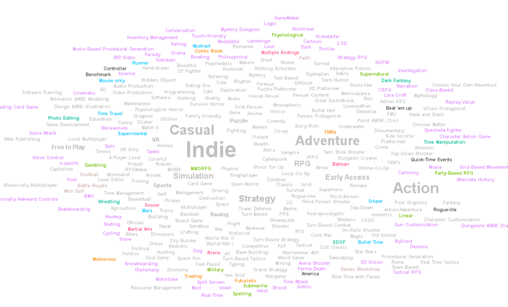

# ECE-143-Analysis-of-Steam-Video-Games



## Team Members
- Jiaxuan Zhang (A15061347)
- Xiaoyang Pan (A59004795)
- Yiming Ren (A59005465)
- Xiangtian Li (A59012851)
- Mohan Li (A59000968)

## Objective

Steam is the world's most popular PC Gaming hub, with over 6,000 games and a community of millions of gamers. Our project aims to analyze, visualize the data of video games sold on the steam platform related to their categories, genre, tags, etc. Then we will further dive into the user classifications and recommendation systems for the datasets. In this way, we will have a better understanding of user behaviors and their preferences for a variety of video games.

## File Structure

```
project
│   README.md
|   ECE-143_Analysis_of_Steam_Video_Games.ipynb
|   Group 17_Analysis of Steam Video Games.pdf
|   tags.gml
|   tags.png
│
└───steamstore
    │   steam.csv
    │
│
└───code
    │   clustering.py
    │   data visualization.py
    │	data preprocessing.py
    |	recommendation.py
    │
```

## How to run the code

Run the ECE-143_Analysis_of_Steam_Video_Games.ipynb jupyter notebook to call all the methods and presented the result of each method. Each method should return figures of analysis results. 

To run the clustering code, you need to use [gephi](https://gephi.org/) to generate `tags.png` from `tags.gml`.

To run the recommendation system, you need to download the [Steam Video Game and Bundle Data](http://deepx.ucsd.edu/public/jmcauley/steam/) and create a `steamrecommend` folder using the following commands

```
wget -q -r -np -A "*.json.gz" http://deepx.ucsd.edu/public/jmcauley/steam/
mkdir steamrecommend
cp ./deepx.ucsd.edu/public/jmcauley/steam/* ./steamrecommend
rm -rf deepx.ucsd.edu/
```

Then you can run `code/recommendation.py` to see the results of our recommendation system.


## Third-Party Modules
- [gephi](https://gephi.org/): The Open Graph Viz Platform
- numpy
- matplotlib
- pandas
- seaborn
- networkx
- cv2